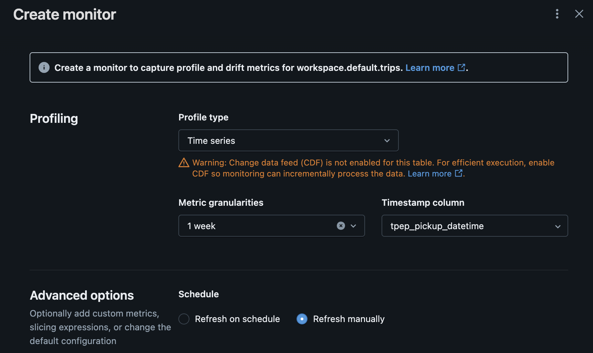

- [Setup a toy Lakehouse Monitoring](#setup-a-toy-lakehouse-monitoring)  
  - [Dashboard](#dashboard)  
  - [Alerts](#alerts)  
- [Pricing](#pricing)  
- [My opinion on what I've seen](#my-opinion-on-what-ive-seen)  
- [Where's Databricks going?](#wheres-databricks-going)  
  - [My2C](#my2c)


### Setup a toy Lakehouse Monitoring

Let's start by creating a table we can work with. It should be a time-series table


```python
%sql
create table workspace.default.sales (
    timestamp TIMESTAMP,
    amount DOUBLE
)
```


I then create a basic notebook `insert 1h of data.ipynb` to fill table with data. Then, setup a job to run that notebook every hour.

I'll not add the code here because it is quite basic. It randomly adds records to the table with random values (within the time windown of the hour).


```python
%sql
select * from workspace.default.sales
limit 10
```


Then, let's create the Monitor via Unity Catalog Explorer 👇

I set up the monitor as `TimeSeries` profile. I pointed out the `timestamp` column and a granularity of 1 hour. The schedule of the monitor is actually daily.

Below, a screenshot of the Unity Catalog Explorer page to create the Lakehouse Monitoring.



What happens after the creation of the Monitoring? By default, two new tables are created

- `<table_name>_profile_metrics`
- `<table_name>_drift_metrics`

Let's inspect them


```python
%sql
SHOW TABLES IN workspace.default;
```


```python
%sql
select * from workspace.default.sales_profile_metrics
```

The **profile** table has a row for each pair
- `window` (the beginning and end of every hour)
- `column_name` every column of the table. In addition, it adds a special row `:table` to compute the table-level profile.

Optionally, it can slice on column values when specified at the time of the creation of the _Monitor_

For each row, it computes a bunch of statistics like `avg`, `quantiles`, `min`, `max`, etc. (when applicable, eg for float columns).


```python
%sql
select * from workspace.default.sales_drift_metrics
```

The **drift** table is similare to the profile table. The **drift** table has a row for each pair
- `window` (the beginning and end of every hour)
- `column_name` every column of the table. In addition, it adds a special row `:table` to compute the table-level profile.

In addition, it has the `window_cmp`, where _cmp_ stands for _compare_. All the statistics are compared against another window (the previous one). There are various statistics like
- `count_delta`
- `ks_test`, in statistics, the Kolmogorov–Smirnov can be used to test whether two samples came from the same distribution

#### Dashboard

Lakehouse Monitoring creates also a dashboard automatically that displays the data in these _profile and drift_ tables.

😓 However, I find this dashboard too crowded and not ready to use. You need to work on it to customize it by yourself.

#### Alerts
Monitor alerts are created and used the same way as other Databricks SQL alerts. You create a Databricks SQL query on the monitor profile metrics table or drift metrics table. You then create a Databricks SQL alert for this query.

### Pricing

Lakehouse Monitoring is billed under a serverless jobs SKU. You can monitor its usage via `system.billing.usage` table or via the Usage dashboard at Account console.

You need to pay attention. I expect that the costs may rise for columns with high number of columns if you don't fine-tune the monitor.


```python
%sql
SELECT usage_date, sum(usage_quantity) as dbus
FROM system.billing.usage
WHERE
  usage_date >= DATE_SUB(current_date(), 30) AND
  sku_name like "%JOBS_SERVERLESS%" AND
  custom_tags["LakehouseMonitoring"] = "true"
GROUP BY usage_date
ORDER BY usage_date DESC
```

### My opinion on what I've seen

Lakehouse monitoring is all about these two profile and drift tables. It is a kind of brute force approach that runs standardized monitoring over the specified table and stores the output in the profiling tables. Is it convenient? It depends on what you're looking for. It is not a free lunch.

**Pros 🟢**

- It takes little **effort** to setup. By default common controls are applied to all columns in the monitored table.
- Most common monitoring scenarios are covered by `TimeSeries` profile or by `Snapshot` profile (I left apart the inference-ML for the sake of simplicity). The **setup time** is shorter when compared to anything made by yourself.
- You have a framework ready to use. You save the time required designing it, and you avoid reinventing the wheel. You can **focus on your business** needs rather than on data engineering stuff.
- I like the simple but effective **design** of the _drift_ metric table and of the windowing. Making something like this by yourself will probably let you hit against some hidden edge-case (like anytime you work with time and dates). 

**Cons 🔴**

- Once the metrics are computed in the profile and drift tables, only half of the job is done. You still have to decide **what** to monitor and **how** to do it. You're probably not interested in monitor any single column in any row of the metric tables (otherwise you may alerted by too many false alarms). A finetuning of the actual alerts is still required, and it is not coming for free.
- You can't know in advance the overall **cost** of the monitoring. You need to try with a realistic (production-alike) scenario and monitor soon how much you're paying. I expect it to depend mainly on
  - the data volume
  - the columns in the table
  - the frequency of the controls


### Where's Databricks going?

In addition to Lakehouse Monitoring, Databricks has released a feature (in Beta) of [data quality monitoring](https://docs.databricks.com/aws/en/lakehouse-monitoring/data-quality-monitoring). This new monitoring

- is quicker to setup. It is toggle on an entire Schema and monitors all the tables in the schema.
- monitors only simple freshness and completeness quality controls
- has no parametrization
- still needs alerts to be set manually

I made a short recap here.

| Feature                    | Lakehouse Monitoring                          | Data Quality Monitoring (Beta)            |
|----------------------------|-----------------------------------------------|-------------------------------------------|
| Scope | Table. It is set at table level. It monitors the table and its columns. | Schema. It is set at schema level and monitors all tables in such schema. |
| Setup | Choose the profile, eventual slicing, window and frequency. | On-off on the schema. |
| What is monitored | Various statistics as snapshot, time series, and inference. | Freshness (is data recent) and completeness (is the volume as expected?) |
| Customization              | Limited | No |
| Alert | To be set manually on the output table. | To be set manually on the output table. |


#### My2C

🟢 I think Databricks is going in the right direction. Fast adoption of basic quality controls. Avoid the "_didn't notice data is old in production_" moments with little effort.

🔴 The alerting setup is still quite SQL-based and there is some trial-and-error around it. I would expect that a basic alert should be enabled by default.
